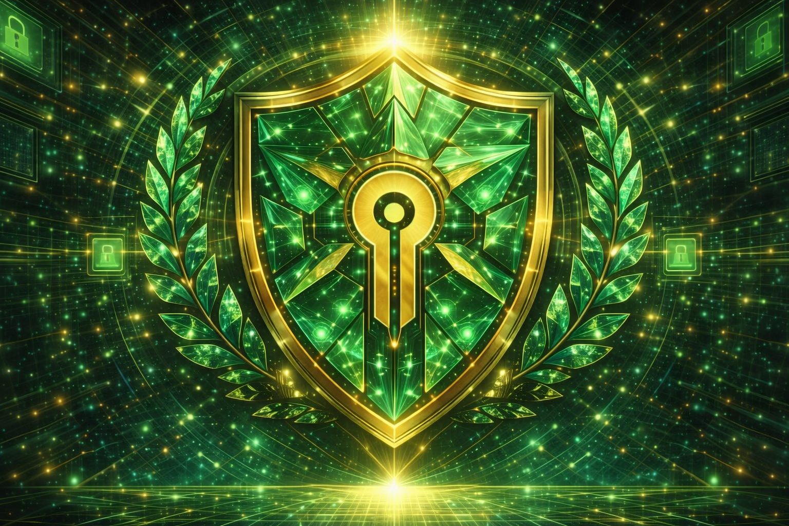

  

  

<h1 align="center">Cedrick Green</h1>

  <b>Lock & Key Cyber</b>

  Cybersecurity • Infrastructure • Systems Operations

  Precision. Structure. Execution.

  U.S. Army Veteran • Defensive Security • Real-World Lab Execution

  
  

---

## ⚔️ Operational Identity

Lock & Key Cyber operates on a controlled system architecture built on three pillars:

- **Security First** — Every system hardened before exposed  
- **Precision Execution** — No guesswork, only verified actions  
- **Controlled Access** — Least privilege, maximum awareness  

  

---

## 🧠 Core Capabilities

- Threat Detection & Analysis  
- Security Monitoring (SOC Operations)  
- Network Traffic Investigation  
- Vulnerability Identification  
- Endpoint Awareness & Defense  
- Linux / Windows System Operations  

  

---

## 🧪 Active Labs

### 🔍 SOC Analyst Lab
- Alert investigation workflow  
- Traffic analysis (PCAP review)  
- Threat identification and escalation  

### 🌐 Network Defense Lab
- Nmap scanning and enumeration  
- Service detection and mapping  
- Attack surface visibility  

### ⚖️ Due Diligence Framework
- Structured threat identification  
- Decision logic and incident states  
- Operational tracking mindset  

  

---

## ⚙️ Tools & Technologies

- Nmap  
- Wireshark  
- Linux (Kali / Ubuntu)  
- Windows Security Tools  
- Git & GitHub  
- SIEM Concepts  

  

---

## 📊 Mission

To transition into a high-level cybersecurity role by demonstrating:

- Real-world lab execution  
- Structured analytical thinking  
- Defensive security expertise  
- Operational discipline  

---

## 🔐 Symbolic System

The Lock & Key Cyber framework is built on layered symbolic architecture that reflects operational reality:

- **Lock** — Security before exposure  
- **Key** — Access through knowledge, earned through verification and execution  
- **Shield** — Defensive posture, integrity, and trust under pressure  
- **Pillars** — Structured systems that support repeatable and disciplined outcomes  
- **Lotus** — Growth through pressure, clarity through complexity  
- **Sacred Geometry** — Intelligence, pattern recognition, and systemic order  

These are not abstract concepts. They are reflected in every lab, system, and workflow built within this environment.

  

---

## 🎤 Interview System

- [Interview Asset](./interview-asset/)
- Slide Deck available in repository

This section reflects my structured approach to cybersecurity operations, including SOC analysis, network defense, and system-level decision making.

---

## 🌐 Freedom Architect System

- Tracking, operational workflow, and execution architecture are maintained through the Freedom Architect command environment.

---

  <b>Structured commands. Controlled systems. Verified outcomes.</b>

